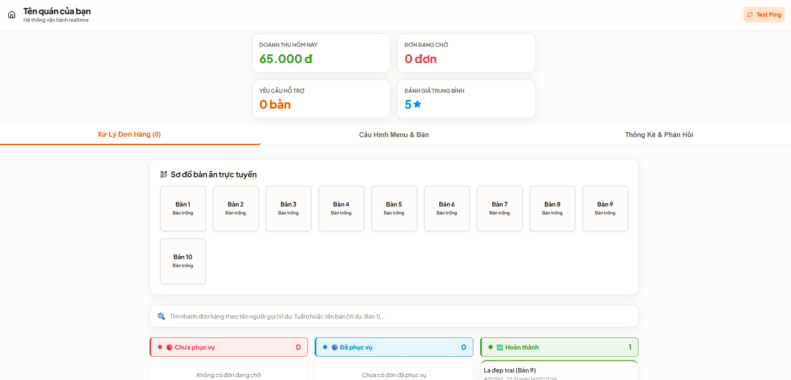
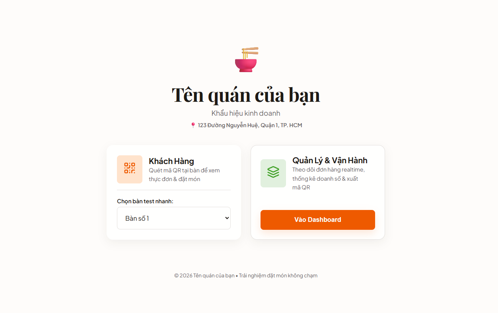
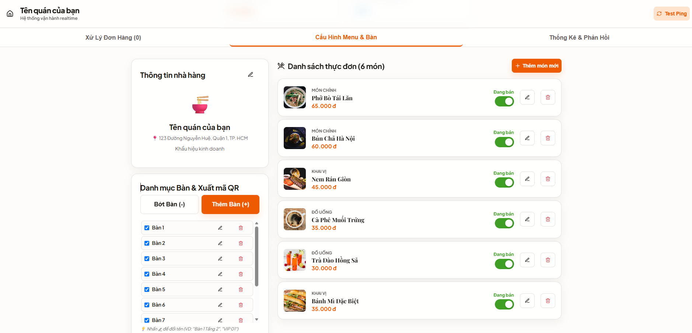
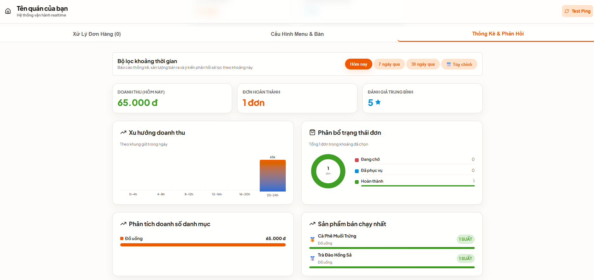
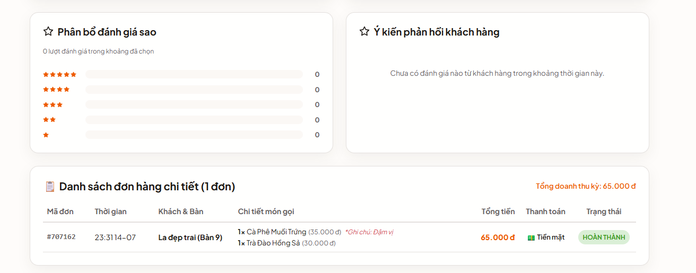

# 🍽️ QROrder - Hệ Thống Đặt Món Tại Bàn Cao Cấp (Realtime QR Code Ordering System)

Hệ thống gọi món và quản lý vận hành trực tuyến qua mã QR thông minh dành cho nhà hàng, quán ăn hiện đại. Thiết kế tối ưu trải nghiệm khách hàng di động và tăng hiệu suất vận hành cho quản lý trên máy tính/laptop.

---

## 📸 Hình ảnh thực tế dự án (Screenshots)

| Giao diện Kanban xử lý đơn hàng | Báo cáo doanh số & Biểu đồ thống kê |
| :---: | :---: |





---

## ✨ Tính Năng Nổi Bật

### 🧑‍💻 Dành Cho Chủ Quán / Người Quản Lý (Dashboard)
*   **Bảng điều khiển Kanban Realtime:** Phân chia đơn hàng thành 3 cột trực quan (Chờ bếp 🔴 - Đã phục vụ 🔵 - Hoàn thành ✅) giúp tránh sót đơn hàng.
*   **Sơ đồ bàn ăn trực tuyến:** Hiển thị trực quan trạng thái từng bàn (Bàn trống, Đang ăn, Gọi phục vụ, Yêu cầu thanh toán) thời gian thực.
*   **Đặt tên bàn tùy chỉnh:** Đổi tên bàn nhanh (Ví dụ: *Bàn 1 Tầng 2*, *VIP 01*, *Sân Vườn*) thay vì chỉ dùng số bàn thô.
*   **Báo cáo & Thống kê doanh số nâng cao:**
    *   Lọc dữ liệu theo Ngày, Tuần, Tháng hoặc **Khoảng ngày tùy chọn bất kỳ**.
    *   Hệ thống 5 biểu đồ SVG cao cấp (Xu hướng doanh thu, Phân bổ trạng thái, Doanh số danh mục, Top món chạy nhất, Phân bổ sao đánh giá).
    *   **Lịch sử đơn chi tiết:** Xem lại toàn bộ hóa đơn của ngày bất kỳ trong quá khứ kèm chi tiết món ăn, tên khách hàng và hình thức thanh toán.
*   **Tìm kiếm đơn hàng thông minh:** Tìm nhanh hóa đơn bằng tên khách hàng hoặc tên bàn khi thanh toán.

### 📱 Dành Cho Khách Hàng (Customer Portal)
*   **Đặt tên gợi nhớ:** Cho phép khách hàng nhập tên xưng hô dễ nhớ (Ví dụ: *Anh Tuấn*, *Chị Lan*) khi gọi món để nhân viên tìm nhanh khi tính tiền.
*   **Gọi nhân viên & Thanh toán không chạm:** Gửi yêu cầu phục vụ hoặc tính tiền trực tiếp từ màn hình điện thoại.
*   **Xem lịch sử & Đánh giá dịch vụ:** Xem lại các món đã đặt trong lượt ăn hiện tại và cho điểm đánh giá sao kèm phản hồi chất lượng.
*   **Bảo mật phiên ăn (Session Isolation):** Hệ thống mã hóa phiên khách hàng giúp tránh việc khách hàng sau quét mã QR thấy đơn hàng của nhóm khách trước đó.

---

## 🛠️ Công Nghệ Sử Dụng

*   **Frontend:** React (Vite), TypeScript, Lucide React (Icons).
*   **Styling:** Vanilla CSS nâng cao, hệ thống màu sắc **OKLCH** hiện đại, thiết kế Responsive hiển thị hoàn hảo từ điện thoại đến máy tính bảng/laptop.
*   **Backend:** Realtime SSE (Server-Sent Events) đồng bộ dữ liệu đa thiết bị cực nhanh.

---

## 🚀 Hướng Dẫn Cài Đặt và Chạy Thử

### 1. Chạy Dưới Local (Dành Cho Phát Triển)
Yêu cầu máy tính cài đặt sẵn [Node.js](https://nodejs.org/).

1.  Tải mã nguồn và di chuyển vào thư mục dự án:
    ```bash
    cd QROrder
    ```
2.  Cài đặt các thư viện phụ thuộc:
    ```bash
    npm install
    ```
3.  Khởi động máy chủ chạy thử (Server đồng bộ realtime + Giao diện Web):
    ```bash
    npm run dev
    ```